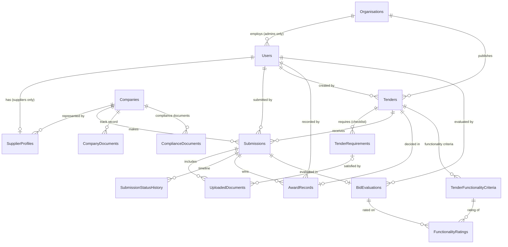

# eProcure: Data Model

Generated SQL for review: [`schema/InitialCreate.sql`](schema/InitialCreate.sql) (idempotent script of the first migration) , [`schema/AddDesignFields.sql`](schema/AddDesignFields.sql) , [`schema/AddTenderPublishingFields.sql`](schema/AddTenderPublishingFields.sql), [`schema/AddSubmissionDeclarations.sql`](schema/AddSubmissionDeclarations.sql) and [`schema/AddEvaluationAndAward.sql`](schema/AddEvaluationAndAward.sql).

## Migration history

| Migration | What it changed |
|---|---|
| `InitialCreate` | All tables, keys, indexes; seeds 2 organisations and 3 roles. |
| `AddDesignFields` | `Tenders.EstimatedValue` (decimal(18,2), optional), `Companies.EnterpriseSize` (text: EME / QSE / Generic; existing rows set to Generic), `Submissions.ReferenceNumber` (nvarchar(20), unique where not NULL, assigned when payment succeeds), RBIDZ branding re-seeded to the design (#0F1B33 / #1CA3EC, `rbidz-logo.png`). |
| `AddTenderPublishingFields` | `Tenders.PointSystem` (text: EightyTwenty / NinetyTen; existing rows set to EightyTwenty), `Tenders.CancelledAtUtc`, `Tenders.CancellationReason` (nvarchar(1000)). A cancelled tender is never deleted; it keeps its reason. |
| `AddSubmissionDeclarations` | SBD answers on `Submissions` become nullable (NULL = not answered yet; a declaration is never a default "No"); new `InterestDetails`, `RestrictionDetails` (nvarchar(1000)) and `DeclaredAtUtc`. |
| `AddEvaluationAndAward` | New table `BidEvaluations` (one per submission: responsive yes/no with reason, bid price, notes, evaluator; points and rank frozen when the BEC submits; `IsRecommended`). `Tenders` gets `EvaluationSubmittedAtUtc`, `EvaluationSubmittedByUserId`, `RecommendationReason` and `BacReturnNote` (all nullable). No existing data changes. |
| `AddApprovalsAndReminders` | `Organisations.RequireTenderApproval`; approval fields on `Tenders` (requested/approved by and when, return note); new table `SentNotifications` (unique `Key`: each scheduled email is sent once). |
| `AddTrackRecordAndFunctionality` | New tables `CompanyDocuments` (track record on the company profile; `RemovedAtUtc` instead of deleting), `TenderFunctionalityCriteria` (name, weight, order per tender) and `FunctionalityRatings` (the BEC's 0-5 rating per bid and criterion, unique per pair). `Tenders.FunctionalityThreshold` (int, NULL = no functionality stage) and `BidEvaluations.FunctionalityScore` (decimal(5,2)). No existing data changes. |
| `AddComplianceDocuments` | New table `ComplianceDocuments` (type, date on the document, calculated or printed expiry date, file details, `ArchivedAtUtc` when replaced or removed). No existing data changes. |

## Entity-relationship diagram

`||` = exactly one, `o|` = zero or one, `o{` = zero or many.
`AuditLog` stands alone (no foreign keys, by design; see DECISIONS D12).

## Relationships in plain language

| # | Relationship | Meaning | Delete rule |
|---|---|---|---|
| 1 | Organisation 1 → * Users | An OrgAdmin/Evaluator belongs to exactly one organisation. Suppliers have `OrganisationId = NULL`. | Restrict |
| 2 | Organisation 1 → * Tenders | Every tender is owned by exactly one organisation. **This is the tenant boundary.** | Restrict |
| 3 | User 1 → 0..1 SupplierProfile | A supplier login has one profile; admin users have none. Enforced by a unique index on `UserId`. | Restrict |
| 4 | Company 1 → * SupplierProfiles | A company can be represented by several people (MVP: usually one). `CompanyId` is NULL until the company profile is filled in. | Restrict |
| 5 | Tender 1 → * TenderRequirements | The required-documents checklist of a tender. | **Cascade** (checklist lines die with a draft tender) |
| 6 | Tender 1 → * Submissions | Applications received by a tender. | Restrict |
| 7 | Company 1 → * Submissions | Applications made by a company, to tenders of **any** organisation. Unique `(TenderId, CompanyId)` means **one application per company per tender**. | Restrict |
| 8 | User 1 → * Submissions | Which supplier user pressed submit (accountability). | Restrict |
| 9 | Submission 1 → * UploadedDocuments | PDFs attached to an application (bytes on disk via `IFileStorage`, metadata here). | Restrict |
| 10 | TenderRequirement 0..1 → * UploadedDocuments | Which checklist item a PDF satisfies (NULL = extra supporting document). | Restrict |
| 11 | Submission 1 → * SubmissionStatusHistory | Append-only timeline; powers "track my application". | Restrict |
| 12 | Tender 1 → 0..1 AwardRecord | The recorded **human** award decision (unique `TenderId`). | Restrict |
| 13 | Submission 1 → * AwardRecord | The successful submission referenced by the award. | Restrict |
| 13b | Submission 1 → 0..1 BidEvaluation | The BEC's evaluation of the bid (unique `SubmissionId`). People record responsiveness and price; points are calculated (PPPFA) and frozen at the BEC's submission. | Restrict |
| 13c | Company 1 → * CompanyDocuments | Track record (reference letters, completion certificates, company profile), uploaded once and part of every bid. The BEC sees the documents held at the closing date. | Restrict (never deleted; "remove" sets `RemovedAtUtc`) |
| 13f | Company 1 → * ComplianceDocuments | CSD report, tax status, B-BBEE, IDs and similar; one current per type, expiry from `ComplianceRules`. Attached to a bid as a COPY (an UploadedDocument), so the profile can change without changing bids. | Restrict (archived, never deleted) |
| 13d | Tender 1 → * TenderFunctionalityCriteria | Functionality criteria and weights (adding up to 100), with `Tenders.FunctionalityThreshold`. | **Cascade** (edited with the draft) |
| 13e | BidEvaluation 1 → * FunctionalityRatings → 1 TenderFunctionalityCriterion | The BEC's 0-5 rating per criterion; the percentage is calculated into `BidEvaluations.FunctionalityScore`. | **Cascade** from the evaluation (re-saved with it); Restrict to the criterion |
| 14 | User 1 → * (Tenders, Documents, History, Awards) | "Created/uploaded/changed/recorded by" references for accountability. | Restrict |

## How tenant isolation works

1. At sign-in (step 2), an admin user's `OrganisationId` is written into their encrypted, server-signed
   authentication cookie as the claim `eprocure:org_id`.
2. `HttpTenantContext` reads that claim on every request (never the URL or a form field).
3. `EProcureDbContext` has global query filters. For OrgAdmin/Evaluator users, EF Core appends
   the tenant condition to every query on:

| Table | Filter for OrgAdmin / Evaluator |
|---|---|
| Tenders | `OrganisationId = @myOrg` |
| TenderRequirements | via `Tender.OrganisationId` |
| AwardRecords | via `Tender.OrganisationId` |
| Submissions | via `Tender.OrganisationId` **and** status not Draft/AwaitingPayment (visible only after payment) |
| UploadedDocuments, SubmissionStatusHistory | via `Submission.Tender.OrganisationId` + same paid rule |
| BidEvaluations | via `Submission.Tender.OrganisationId` + same paid rule |
| TenderFunctionalityCriteria | via `Tender.OrganisationId` |
| FunctionalityRatings | via `BidEvaluation.Submission.Tender.OrganisationId` + same paid rule |
| CompanyDocuments | only if the company has a submitted (paid) bid to one of `@myOrg`'s tenders; pages add "after closing" and "held at the closing date" |
| ComplianceDocuments | never: organisation staff see only the copy attached to a bid |
| AuditLog | `OrganisationId = @myOrg` |

4. If an admin has no organisation claim, `@myOrg` is NULL and they see **nothing** (fail closed).
5. Suppliers are not org-scoped (they need the cross-organisation marketplace). Their *own* restriction
   ("only my company's submissions") is applied in the supplier queries (steps 5-6).

## Unique constraints (database-enforced business rules)

| Index | Rule |
|---|---|
| `Organisations(Code)` | Organisation codes are unique. |
| `Tenders(OrganisationId, ReferenceNumber)` | A bid number is unique **within** an organisation. |
| `Submissions(TenderId, CompanyId)` | No duplicate applications. |
| `Submissions(ReferenceNumber)` (filtered: NOT NULL) | Each paid application has its own reference. |
| `Companies(RegistrationNumber)`, `Companies(CsdNumber)` | A legal entity is registered once. |
| `SupplierProfiles(UserId)` | One profile per supplier login. |
| `AwardRecords(TenderId)` | One award per tender (MVP). |
| `BidEvaluations(SubmissionId)` | One BEC evaluation per bid. |
| `FunctionalityRatings(BidEvaluationId, TenderFunctionalityCriterionId)` | One rating per criterion per bid. |
| `CompanyDocuments(StorageKey)` | Each stored track-record file is referenced once. |
| `UploadedDocuments(StorageKey)` | Each stored file is referenced once. |

## POPIA register: personal information per table

| Table | Personal information held | Purpose | Who can access |
|---|---|---|---|
| Organisations | None (organisational data) | Tenant branding/config | Everyone (public branding) |
| Users | Full name, email, **cellphone number** (suppliers: required and verified by OTP), password **hash** only | Authentication, OTP verification, accountability | The user; platform operator |
| Roles / UserRoles | Role membership | Authorisation | Platform operator |
| SupplierProfiles | Job title, **cellphone number** (collected at registration), POPIA consent time | Contacting the bidder; OTP | The supplier; organisations only via a submission to *their* tender |
| Companies | Juristic-person data (reg no., tax PIN, CSD no., B-BBEE level, enterprise size) | Bid eligibility | The supplier; organisations only via a submission to *their* tender |
| Tenders / TenderRequirements | None (internal creator reference) | Publishing tenders | Public when published; drafts only the owning org |
| Submissions | Link between company, user and tender; SBD declarations; **payment reference only, never card data** | Evaluating bids | The submitting supplier; owning organisation after payment |
| UploadedDocuments | Metadata; PDFs may contain directors' ID copies etc. | Evaluating bids | Same as the parent submission |
| SubmissionStatusHistory | Who changed status, when | Transparency to bidder, audit | Same as the parent submission |
| BidEvaluations | Evaluating official reference; committee notes about a juristic person's bid | Record of the BEC's evaluation | Owning organisation only (bidders see only their outcome, points and rank, and the winner's published award notice) |
| CompanyDocuments | Reference letters may name people at the client; uploader reference | Track record for evaluation | The supplier; an organisation only through a submitted bid to its own tender, after closing |
| ComplianceDocuments | **Certified ID copies of directors** (identity numbers, photos); bank confirmation letters | Proving compliance when bidding | The supplier only; an organisation sees the copy attached to a bid to its own tender, after closing |
| TenderFunctionalityCriteria / FunctionalityRatings | None (criteria); evaluating official via the evaluation | Functionality evaluation | Criteria public with the tender; ratings owning organisation only |
| AwardRecords | Deciding official reference | Record of human decision | Owning organisation |
| AuditLog | User id/email, IP address | Accountability, security | Platform operator; owning organisation for its own rows |

**Not collected:** ID numbers of supplier users, home addresses, dates of birth, bank or card details.
